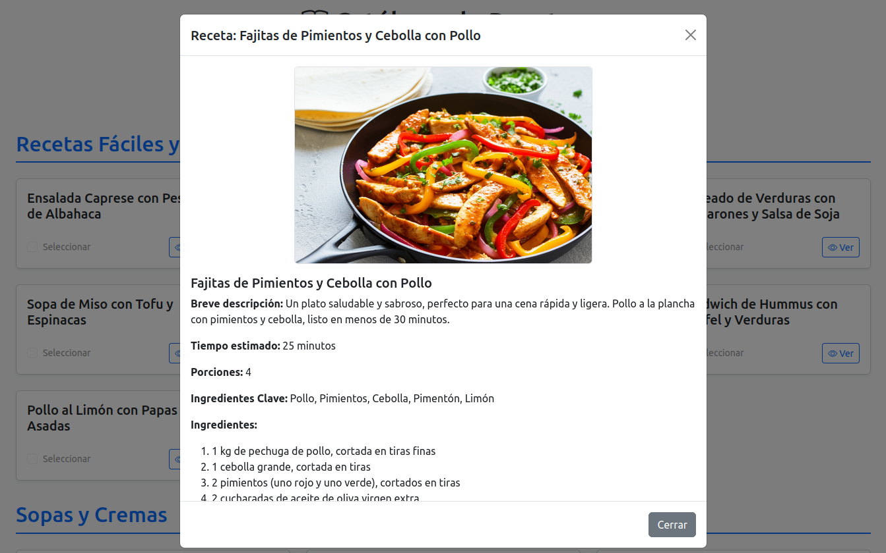

# 🍳 Gemini Recipe Generator App

[](https://opensource.org/licenses/MIT) [](https://soyunomas.github.io/gemini-recipe-generator-app/index.html)

Una aplicación web interactiva que utiliza la API de Google Gemini para generar catálogos de recetas internacionales, visualizarlas y prepararlas para imprimir. 🍲

## 📝 Descripción Breve

Este proyecto proporciona una interfaz web para generar dinámicamente un catálogo variado de recetas de cocina internacional utilizando Google Gemini. Permite a los usuarios explorar recetas categorizadas, ver detalles completos (ingredientes, pasos, imagen opcional generada por IA), seleccionar sus favoritas y preparar una vista formateada para la impresión.

## 🖼️ Captura de Pantalla / Demo

 

Puedes probar la demo en vivo aquí:

*   **[Demo - Probar App](https://soyunomas.github.io/gemini-recipe-generator-app/index.html)**

## ✨ Características Principales

*   **🤖 Generación con IA:** Utiliza Google Gemini para crear catálogos de recetas variados y detalles específicos de cada receta bajo demanda.
*   **🌍 Cocina Internacional:** Enfocado en generar recetas de diversas cocinas del mundo.
*   **🗂️ Categorización Dinámica:** Las recetas se presentan organizadas por categorías (ej. "Fáciles y Rápidas", "Sopas", "Carnes", etc.) generadas por la IA.
*   **👁️ Visualización Detallada:** Modal interactivo para ver la descripción completa, ingredientes clave, lista de ingredientes, pasos de preparación y (opcionalmente) una imagen generada por IA de la receta.
*   **✅ Selección para Impresión:** Permite marcar recetas individuales para incluirlas en una compilación para imprimir.
*   **📄 Preparación para Impresión:** Genera una vista limpia y formateada (optimizada para A4) de las recetas seleccionadas, lista para ser impresa desde el navegador.
*   **🔑 Gestión de API Key:** Interfaz para introducir y guardar (en `localStorage`) la API Key de Google Gemini necesaria.
*   **🔄 Carga de Catálogo Bajo Demanda:** Botón para solicitar un nuevo conjunto de recetas a la IA, con intentos de evitar repeticiones.
*   **🎨 Interfaz Clara:** Diseño limpio y funcional basado en Bootstrap 5.
*   **📱 Diseño Responsivo:** Adaptable a diferentes tamaños de pantalla.
*   **⚙️ Código Autónomo:** Aplicación contenida en un solo archivo HTML para simplicidad (HTML, CSS, JS).

## 🛠️ Tecnologías Utilizadas

*   **HTML5:** Estructura semántica del contenido.
*   **CSS3:** Estilos personalizados para tarjetas, modal, estados visuales y formato de impresión.
*   **Bootstrap 5.3.x:** Framework CSS/JS para layout responsivo, componentes (modal, grid, cards, alerts) y utilidades.
*   **Bootstrap Icons:** Para iconografía (ej., libro, impresora, ojo, check).
*   **JavaScript (ES6+):** Lógica de la aplicación:
    *   Interacción con la **API de Google Gemini** (usando `fetch` para modelos de texto e imagen).
    *   Manipulación dinámica del DOM para mostrar el catálogo y los detalles de las recetas.
    *   Gestión de eventos (clics en botones y tarjetas, selección de checkboxes).
    *   Manejo de estado simple (API Key, recetas cacheadas, recetas seleccionadas).
    *   Formateo de texto (Markdown básico a HTML).
    *   Generación de contenido para la ventana de impresión.
*   **Google Gemini API:** Modelos como `gemini-1.5-flash-latest` (texto) y `gemini-2.0-flash-exp-image-generation` (imágenes) para la generación de contenido.
*   **CDNs:** Bootstrap (CSS y JS) y Bootstrap Icons se cargan desde CDNs.

## 🚀 Instalación / Visualización Local

Esta es una aplicación web estática del lado del cliente. Para ejecutarla localmente:

1.  **Clona el repositorio:**
    ```bash
    git clone https://github.com/soyunomas/gemini-recipe-generator-app.git
    ```
2.  **Navega al directorio del proyecto:**
    ```bash
    cd gemini-recipe-generator-app
    ```
3.  **Abre el archivo HTML principal:**
    *   Abre el archivo `index.html` directamente en tu navegador web preferido (Chrome, Firefox, Edge, etc.).
4.  **🔑 Proporciona tu API Key de Google Gemini:**
    *   La aplicación te pedirá que introduzcas tu API Key la primera vez. Pégala en el campo correspondiente y haz clic en "Guardar y Continuar". La clave se guardará en el `localStorage` de tu navegador para futuras sesiones (no se envía a ningún servidor externo).
    *   **Alternativamente:** Puedes hardcodear tu API Key directamente en la variable `apiKey` dentro de la etiqueta `<script>` en el archivo `index.html` si prefieres no usar la interfaz (¡no subas tu clave hardcodeada a un repositorio público!).
5.  **🌐 Conexión a Internet:** Es necesaria para:
    *   Cargar Bootstrap (CSS y JS) y Bootstrap Icons desde sus CDNs.
    *   Realizar las llamadas a la API de Google Gemini.
6.  **(Sin Dependencias Adicionales):** No se requiere instalación de software adicional ni servidores locales.

## 🕹️ Cómo Usar

1.  **Configura la API Key:** Si es la primera vez, introduce tu clave de Google Gemini cuando se te solicite.
2.  **Carga el Catálogo:** Haz clic en el botón "Cargar Nuevo Catálogo". La aplicación contactará a Gemini para generar una lista de recetas organizadas por categorías. Espera a que finalice el proceso (verás un indicador de carga).
3.  **Explora:** Navega por las diferentes categorías y las tarjetas de recetas generadas.
4.  **Visualiza Detalles:** Haz clic en una tarjeta de receta (o en su botón "Ver"). Se abrirá un modal con:
    *   El nombre de la receta.
    *   (Si está habilitado) Una imagen generada por IA del plato.
    *   Una descripción, tiempo estimado, porciones.
    *   Ingredientes clave destacados.
    *   Lista completa de ingredientes.
    *   Instrucciones paso a paso.
5.  **Selecciona para Imprimir:** Una vez que has visto los detalles de una receta, el checkbox "Seleccionar" en su tarjeta se habilitará. Márcalo si deseas incluir esa receta en tu selección para imprimir. La tarjeta cambiará visualmente para indicar que está seleccionada. Puedes seleccionar múltiples recetas.
6.  **Prepara la Impresión:** Cuando hayas seleccionado todas las recetas deseadas, haz clic en el botón "Preparar Impresión de Recetas Seleccionadas" (aparecerá en la parte inferior).
7.  **Imprime:** Se abrirá una nueva ventana/pestaña del navegador con las recetas seleccionadas formateadas para impresión. Usa la función de impresión de tu navegador (Ctrl+P o Cmd+P) para imprimir el documento o guardarlo como PDF.

## 📄 Licencia

Este proyecto está bajo la Licencia MIT.
[](https://opensource.org/licenses/MIT)

## 🧑‍💻 Contacto

Creado por **soyunomas** ([@soyunomas en GitHub](https://github.com/soyunomas))

---
